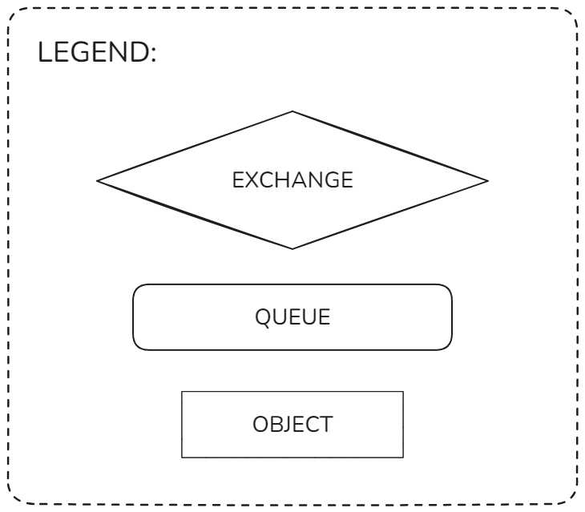
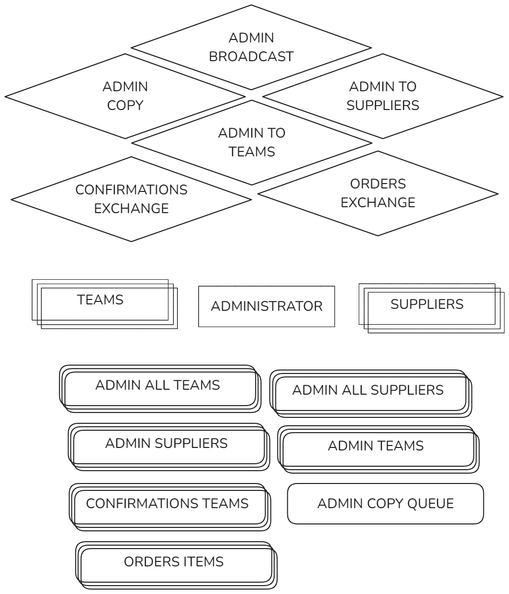

# System Obsługi Zleceń na Sprzęt Górski z użyciem RabbitMQ

## Opis projektu

Organizacja zimowej wyprawy górskiej lub wysokogórskiej to trudne zadanie, szczególnie w zakresie zebrania odpowiedniego sprzętu. Niektóre ekipy biorą ze sobą tlen, inne nie dopuszczają takiej możliwości; jedni turyści korzystają z zestawu puchowej odzieży, inni wolą morsować. Niezależnie od potrzeb, obsługa zleceń na sprzęt do wypraw górskich wymaga zapewnienia odpowiedniej komunikacji.

### Zadanie

Zaimplementuj z użyciem **RabbitMQ** system pośredniczący pomiędzy ekipami zmierzającymi na wyprawę górską (**Ekipa**), a dostawcami sprzętu górskiego (**Dostawca**). Ekipy mogą zamawiać różne typy sprzętu, natomiast każdy Dostawca posiada swoją listę dostępnych u niego typów sprzętu.

## Zasady sprzedaży (ustalone przez Dostawców)

- Ceny poszczególnych typów sprzętu są takie same u wszystkich Dostawców (nie są uwzględniane przy rozdzielaniu zamówień).
- Zlecenia powinny być rozkładane pomiędzy Dostawców **w sposób zrównoważony**.
- Jedno zlecenie **nie może trafić do więcej niż jednego Dostawcy**.
- Zlecenia identyfikowane są przez **nazwę Ekipy** oraz **wewnętrzny numer zlecenia nadawany przez Dostawcę**.
- Po wykonaniu zlecenia Dostawca wysyła **potwierdzenie do Ekipy**.

## Wersja Premium – Moduł Administracyjny

Dostępny jest dodatkowy moduł administracyjny. Administrator:

- otrzymuje kopię **wszystkich wiadomości** przesyłanych w systemie,
- ma możliwość wysyłania wiadomości w trzech trybach:
  - do **wszystkich Ekip**,
  - do **wszystkich Dostawców**,
  - do **wszystkich Ekip oraz Dostawców**.

## Wymagania dotyczące dokumentacji

Projekt musi zawierać dokumentację w postaci **schematu działania systemu**, który powinien uwzględniać:

- użytkowników, exchange, kolejki, klucze użyte przy wiązaniach,
- schemat musi być w postaci **elektronicznej** (nie może to być skan odręcznego rysunku).

---

## Scenariusz prezentacji systemu

1. **Omówienie schematu.**
2. **Uruchomienie dwóch Ekip** (z wybranymi nazwami).
3. **Uruchomienie dwóch Dostawców**:
   - **Dostawca 1**: obsługuje sprzęt `tlen`, `buty`
   - **Dostawca 2**: obsługuje sprzęt `tlen`, `plecak`
4. _(Wersja premium)_ Uruchomienie **1 Administratora**
5. **Ekipa 1** przesyła serię zleceń: `tlen`, `tlen`, `buty`, `buty`, `plecak`, `plecak`
6. _(Wersja premium)_ Administrator wysyła 3 wiadomości:

- do wszystkich Ekip
- do wszystkich Dostawców
- do wszystkich Ekip i Dostawców

7. **Prezentacja wyników działania systemu** – co wypisały:

- Ekipa 1
- Ekipa 2
- Dostawca 1
- Dostawca 2
- Administrator

8. **Założenie testowe**: zlecenia obsługiwane są **natychmiast**.
9. **Każda operacja (wysłanie i odebranie zlecenia)** powinna być **wypisana**.

---

## Punktacja

| Element                   | Punkty |
| ------------------------- | ------ |
| Schemat działania systemu | 2      |
| Obsługa Ekip i Dostawców  | 5      |
| Moduł administracyjny     | 3      |


# Rozwiązanie

## Schemat działania systemu
  


## Przykładowe wyjście `main.py`
```
Uruchamianie systemu...
Uruchamianie Ekip...
[EKIPA1] Zainicjalizowany
[EKIPA2] Zainicjalizowany
[EKIPA1] Nasłuchiwanie...
[EKIPA2] Nasłuchiwanie...
Uruchamianie Dostawców...
[DOSTAWCA1] Zainicjalizowany: tlen, buty
[DOSTAWCA2] Zainicjalizowany: tlen, plecak
[DOSTAWCA1] Nasłuchiwanie...
Uruchamianie Administratora...
[ADMINISTRATOR] Zainicjalizowany
[ADMINISTRATOR] Nasłuchiwanie...
Wysyłanie zleceń...
[EKIPA1] Wysłano zlecenie: tlen (ID: 1)
[EKIPA1] Wysłano zlecenie: tlen (ID: 2)
[DOSTAWCA1] Otrzymano zlecenie od EKIPA1: tlen (ID: 2)
[DOSTAWCA2] Otrzymano zlecenie od EKIPA1: tlen (ID: 1)
[ADMINISTRATOR] CC zlecenie: EKIPA1 zamówiła: tlen (ID: 1)
[ADMINISTRATOR] CC zlecenie: EKIPA1 zamówiła: tlen (ID: 2)
[EKIPA1] Wysłano zlecenie: buty (ID: 3)
[DOSTAWCA1] Wykonano zlecenie od EKIPA1: tlen (ID: 2)
[ADMINISTRATOR] CC potwierdzenie: DOSTAWCA1 wykonał zlecenie dla EKIPA1 (ID: 2)
[DOSTAWCA2] Wykonano zlecenie od EKIPA1: tlen (ID: 1)
[EKIPA1] Otrzymano potwierdzenie od DOSTAWCA1: tlen (ID: 2)
[ADMINISTRATOR] CC zlecenie: EKIPA1 zamówiła: buty (ID: 3)
[EKIPA1] Wysłano zlecenie: buty (ID: 4)
[EKIPA1] Otrzymano potwierdzenie od DOSTAWCA2: tlen (ID: 1)
[DOSTAWCA1] Otrzymano zlecenie od EKIPA1: buty (ID: 3)
[ADMINISTRATOR] CC potwierdzenie: DOSTAWCA2 wykonał zlecenie dla EKIPA1 (ID: 1)
[DOSTAWCA2] Otrzymano zlecenie od EKIPA1: plecak (ID: 5)
[EKIPA1] Wysłano zlecenie: plecak (ID: 5)
[DOSTAWCA1] Wykonano zlecenie od EKIPA1: buty (ID: 3)
[EKIPA1] Otrzymano potwierdzenie od DOSTAWCA1: buty (ID: 3)
[DOSTAWCA1] Otrzymano zlecenie od EKIPA1: buty (ID: 4)
[DOSTAWCA2] Wykonano zlecenie od EKIPA1: plecak (ID: 5)
[EKIPA1] Otrzymano potwierdzenie od DOSTAWCA2: plecak (ID: 5)
[DOSTAWCA2] Otrzymano zlecenie od EKIPA1: plecak (ID: 6)
[ADMINISTRATOR] CC zlecenie: EKIPA1 zamówiła: buty (ID: 4)
[EKIPA1] Otrzymano potwierdzenie od DOSTAWCA1: buty (ID: 4)
[DOSTAWCA1] Wykonano zlecenie od EKIPA1: buty (ID: 4)
[EKIPA1] Wysłano zlecenie: plecak (ID: 6)
[ADMINISTRATOR] CC zlecenie: EKIPA1 zamówiła: plecak (ID: 5)
[DOSTAWCA2] Wykonano zlecenie od EKIPA1: plecak (ID: 6)
[ADMINISTRATOR] CC potwierdzenie: DOSTAWCA1 wykonał zlecenie dla EKIPA1 (ID: 3)
[EKIPA1] Otrzymano potwierdzenie od DOSTAWCA2: plecak (ID: 6)
[ADMINISTRATOR] CC potwierdzenie: DOSTAWCA2 wykonał zlecenie dla EKIPA1 (ID: 5)
[ADMINISTRATOR] CC potwierdzenie: DOSTAWCA1 wykonał zlecenie dla EKIPA1 (ID: 4)
[ADMINISTRATOR] CC zlecenie: EKIPA1 zamówiła: plecak (ID: 6)
[ADMINISTRATOR] CC potwierdzenie: DOSTAWCA2 wykonał zlecenie dla EKIPA1 (ID: 6)
Wysyłanie wiadomości od Administratora...
[ADMINISTRATOR] Wysłano wiadomość do wszystkich Ekip: Halo Ekipy!
[ADMINISTRATOR] Wysłano wiadomość do wszystkich Dostawców: Halo Dostawcy!
[ADMINISTRATOR] Wysłano wiadomość do wszystkich: Halo Ekipy i Dostawcy!
[DOSTAWCA2] Wiadomość od Administratora (do Dostawców): Halo Dostawcy!
[DOSTAWCA1] Wiadomość od Administratora (do Dostawców): Halo Dostawcy!
[DOSTAWCA2] Wiadomość od Administratora (do wszystkich): Halo Ekipy i Dostawcy!
[EKIPA2] Wiadomość od Administratora (do Ekip): Halo Ekipy!
[EKIPA1] Wiadomość od Administratora (do Ekip): Halo Ekipy!
[EKIPA2] Wiadomość od Administratora (do wszystkich): Halo Ekipy i Dostawcy!
[EKIPA1] Wiadomość od Administratora (do wszystkich): Halo Ekipy i Dostawcy!
[DOSTAWCA1] Wiadomość od Administratora (do wszystkich): Halo Ekipy i Dostawcy!
Zamykanie systemu...
```
